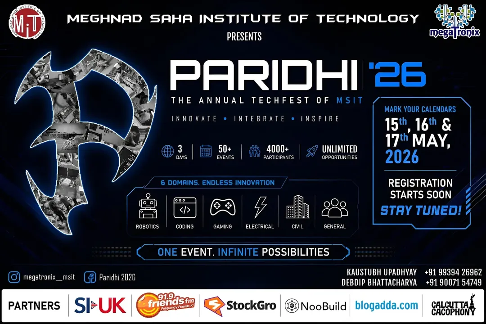

# PARIDHI 2026 | Mobile Application

    

## About the Project
**Paridhi 2026** is the official mobile application for Megatronix, designed to provide a seamless digital experience for event participants and organizers. The app features a high-performance registration system, real-time event tracking, and a premium technical aesthetic .

### Key Features
- **Intelligent Registration:** Dynamic forms that scale based on event requirements.
- **Event Management:** Real-time tracking of technical events and combo packs.
- **Operator Dashboard:** Secure management of user profiles and registration history.
- **Megatronix Aesthetic:** A custom UI featuring accents and micro-animations.

---

## Download the App
Get the latest version of the Paridhi 2026 application for your Android device:

**[Download Paridhi v1.0.0 APK](https://getparidhi2k26app.netlify.app/)** 

---

## Source Code Access
The source code for this project is currently private to ensure the security and integrity of the event's registration and management protocols during the fest.

**The complete codebase will be made available to the public on:**
**May 18th, 2026 at 00:00 Hours**

---

**Created with ❤️ by thetwodigiter**